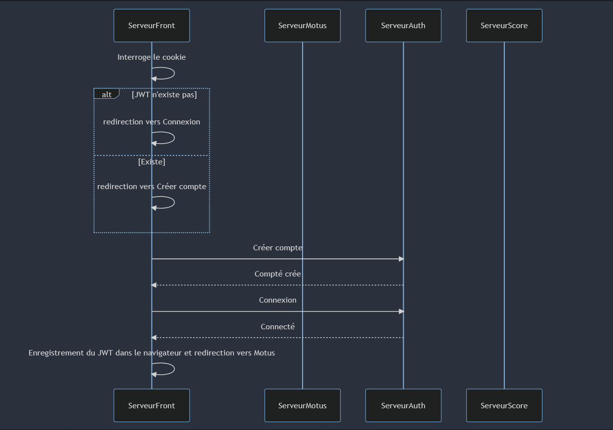
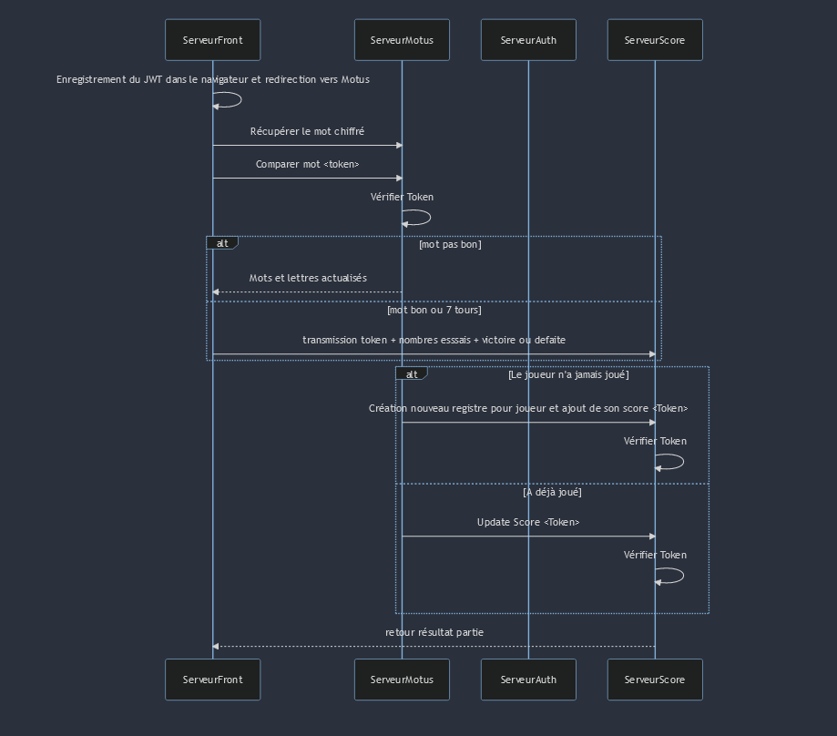
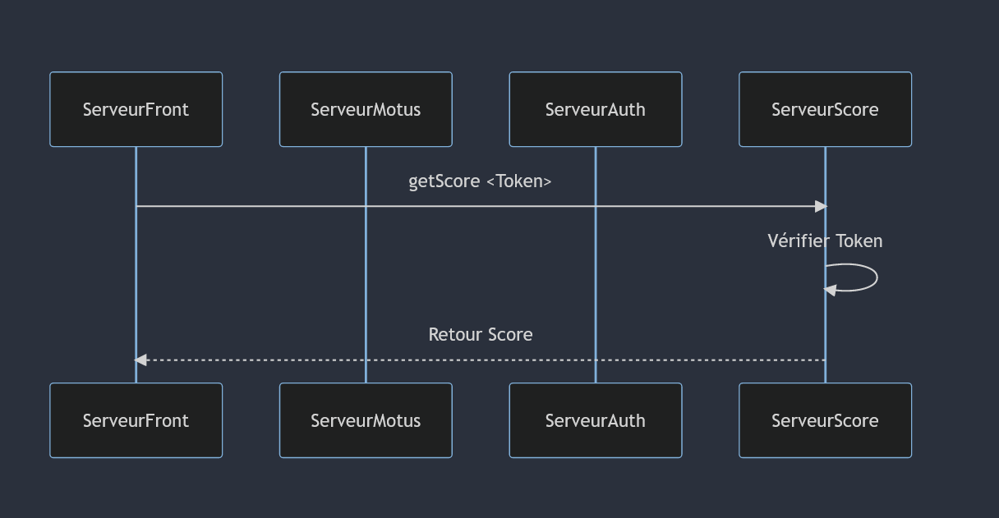
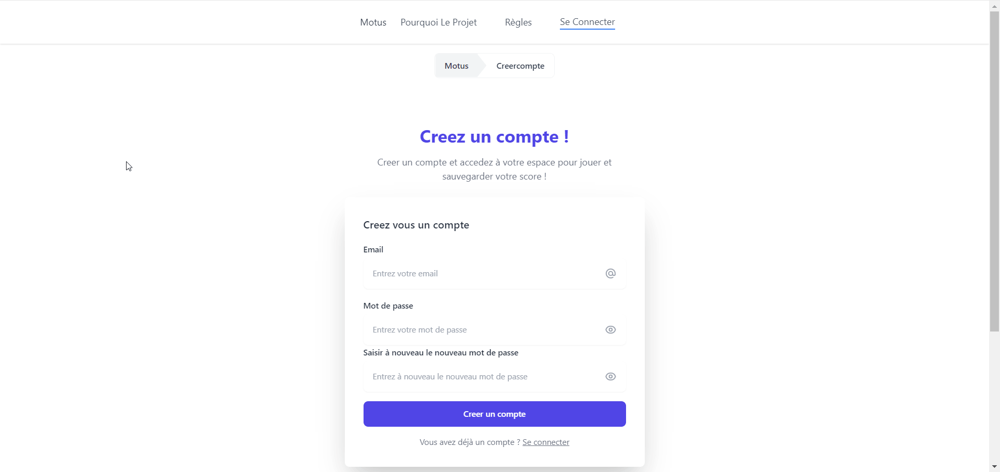
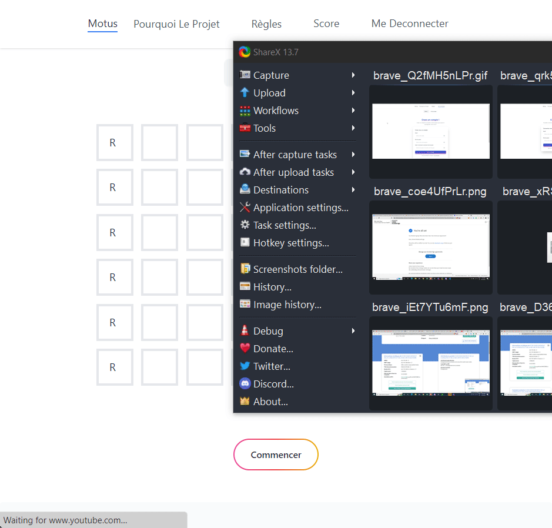
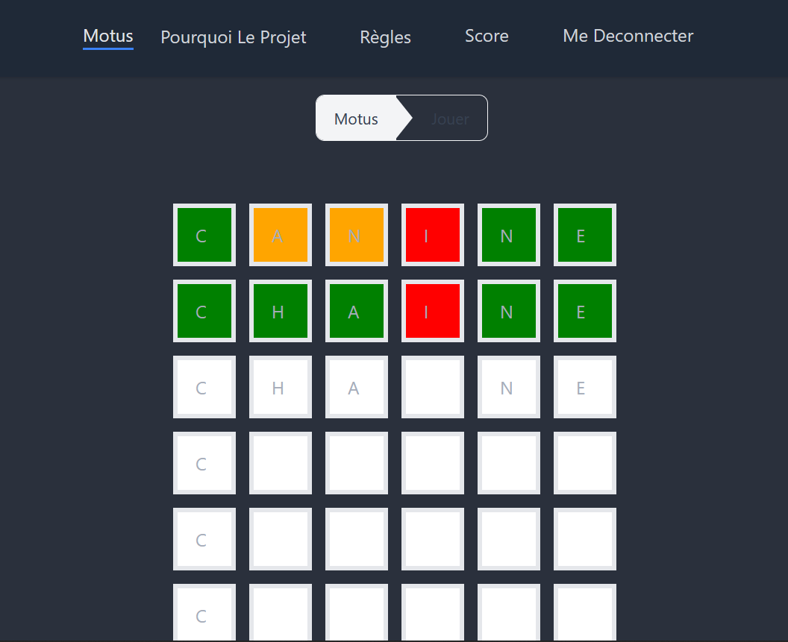

# Motus 
## Installation 
#### Par Docker :
```
 - cd ../Auth
 - docker build . -t yassibra/motus-auth
 - cd ../Score
 - docker build . -t yassibra/motus-score
 - cd ../Motus
 - docker build . -t yassibra/motus-motus
 - cd ../Front
 - docker build . -t yassibra/motus-front
 - cd ../
 - docker compose up -d
```

#### Sans Docker : 
 >- Dans le dossier Auth :
 (supprimez node_modules)
  ```
  npm i 
  npm run dev
 ```
 
 >- dans le dossier Motus : 
  (supprimez node_modules) 
  ```
  npm i npm 
  run dev
 ```
 >- dans le dossier Score : 
  (supprimez node_modules)
   ```
  npm i 
  npm run dev
 ```
 >- dans le dossier Front : 
  (supprimez node_modules) 
   ```
  npm i 
  npm run dev
 ```
 
## Fonctionnement 
-  Connexion

- jeu

- score

## Creation de compte et connexion

<p align="center">
  
</p>  

## Jeu Motus

<p align="center">
  
</p>  
   
 ## Consultez son score


## Regle du jeu 
Le jeu repose sur la recherche d'un mot en 6 essais dont la première lettre est fournit. A la fin de chaque tentative, Motus colorie les cases pour vous orienter vers le bon résultat. Les cases vertes, représente les lettres bien placées, les cases orange, les lettres mal placées et en rouge, les lettres incorrectes. L'objectif étant de trouver le résultat en un minimum de tentative. A vous de jouer !

## Axes d'améliorations
On est conscient que certains mécanismes du jeu ne fonctionnent pas parfaitement ou encore que certains traitements pourraient être largement améliorés en terme de compléxité algorithmique. Néanmoins, le but de ce projet a été de comprendre les avantages des microservices et comment facilement les déployer quand cela est nécessaire.

L'interaction entre le serveur motus et le serveur score pour update le score ne fonctionne pas dans la version dockerisé. Il faudrait mettre en place un reverse proxy pour assurer des communications tripartite de la sorte. Néanmoins le jeu, le score fonctionne au même titre que l'authentification sécurisé avec un JWT HttpOnly. 

On pourra noter que le passage d'un jwt non HttpOnly à un jwt HttpOnly a été d'une plus value car le jwt n'est plus accessible via commandes javascript. Néanmoins cette plus value est faible car sa mise en place a nécessité la modification du fonctionnement de tous les microservices -  (CORS, whitelist, etc.) - ce qui n'est pas la vocation des microservices d'autant plus que l'on n'est pas à l'abri de failles CSRF. 
